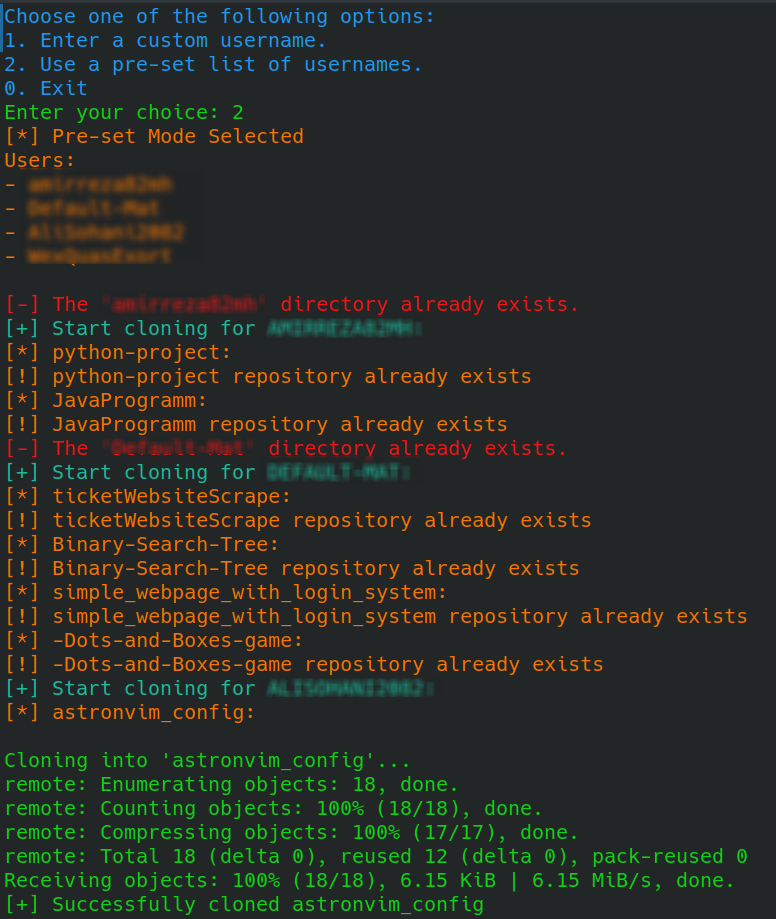

# GitHub Repository Cloner
This is a Python script that allows you to clone all the repositories of a given user or a list of users from GitHub.

## Prerequisites
* Python 3.x
* `requests`, `beautifulsoup4`, and `colorama`Python modules.
You can install these dependencies through pip:

```
pip install requests beautifulsoup4 colorama
```

## Usage
* Clone this repository or download the script `github_repo_cloner.py`.
* Run the script using the command:

```
python github_repo_cloner.py
```

* Choose one of the following options:
* Enter a custom username: You will be prompted to enter the GitHub username for cloning repos of that user.
* Use a pre-set list of usernames: The script will look for a file named `users.txt` in the same directory, which should contain a list of GitHub usernames (each on a separate line) whose repositories you want to clone.
* Exit: To exit the script.
* Once you choose an option, the script will start cloning the repositories of the selected GitHub user(s) into the `users/{username}` directory.

## Notes
* If a repository already exists in the directory, it will not be cloned again.
* If the specified username is invalid, the script will print an error message.
* The script uses Git to clone the repositories, make sure it is installed on your system and available in the PATH.
* The script uses the Colorama module to colorize the console output, which is only supported in certain operating systems/environments.

## ScreenShots

